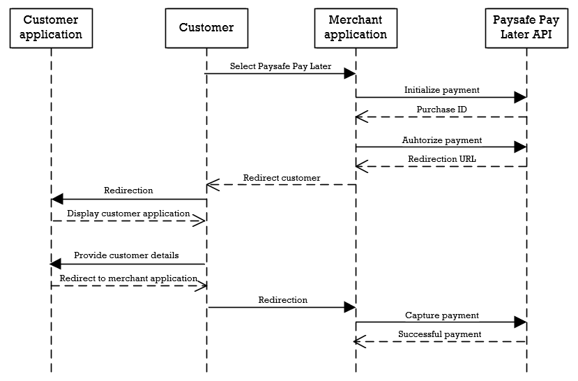
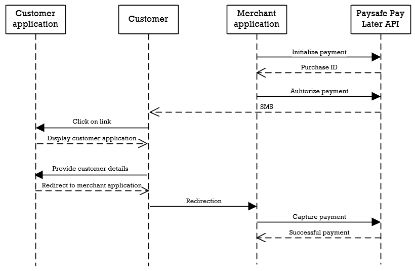

# Integrations: API integration

API Integration is the most flexible option of allowing payments via Paysafe in an application. Integration can be done directly via the API or with one of our SDKs. This integration has two ways of navigating customers torwards the Paysafe payment application. The URL redirection flow provides the application with a URL which can be used to redirect the customer to the Paysafe application from within a browser. The other flow sends the customer a SMS with the link which can be opened on their smartphone and complete the application from there.

**Note**: all SDK examples assume the SDK has been initiliazed. For more details on how to initialize the SDK, check the paragraph 'SDK initialization' in the corresponding SDK documentation.

## URL redirection flow



### 1. Initialize

The flow starts when the customer selects the Pay later option. At that point, your system should initialize the payment by providing at least the amount and currency of the order towards the API. Optionaly, customer data can be provided to ease the application process for the customer. The success response of the initialize endpoint returns the **purchaseId** needed for the authorize endpoint.

**Rest endpoint**

```json http
{
  "method": "post",
  "url": "https://test-gateway.payolution.com/purchase/initialize",
  "headers": {
    "paysafe-pl-secret-key": "secret-key",
    "Content-Type": "application/json"
  },
  "body": {
    "purchaseAmount": {
      "amount": 50000,
      "currency": "EUR"
    }
  }
}
```

**Java SDK**

```java
InitializePurchaseRequest request = new InitializePurchaseRequest()
  .withPurchaseAmount(new Amount()
    .withAmount(50000L)
    .withCurrency(Currency.EUR));

ResponseWithAuthorization<PurchaseOperationResponse> purchaseResponse = 
  purchaseApi.intializePurchase(request, secretKey);

// Bearer eyJhbGciOiJSUzI1NiIsInR5cCI6IkpXVCJ9
String accessToken = purchaseResponse.getAuthorization();

PurchaseOperationResponse response = purchaseResponse.getResponse();
String purchaseId = response.getPurchaseId();
```

**PHP SDK**

```php
$request = new InitializePurchaseRequest(
  new Amount(50000, new Currency(Currency::EUR))
);

$purchaseResponse = $purchaseLifecycleApi->initializePurchase($request, $secretKey);

// Bearer eyJhbGciOiJSUzI1NiIsInR5cCI6IkpXVCJ9
$accessToken = $purchaseResponse->getAuthorization();

$response = $purchaseResponse->getResponse();
$purchaseId = $response->getPurchaseId();
```

**Node.js SDK**

```javascript
const request = new InitializePurchaseRequest()
  .withPurchaseAmount(new Amount()
    .withAmount(50000)
    .withCurrency(Currency.EUR));

const purchaseResponse = await purchaseApi.intializePurchase(request, secretKey);

// Bearer eyJhbGciOiJSUzI1NiIsInR5cCI6IkpXVCJ9
const accessToken = purchaseResponse.authorization;

const response = purchaseResponse.response;
const purchaseId = response.getPurchaseId();
```

### 2. Authorize

Once a succesful initialize response has been received, the **purchaseId**, of the response, must be provided in the authorization request. In addition, two optional URLs can be provided. A **successUrl**, which the customer will be redirected back to when the payment has been processed and a **callbackUrl** which will receive multiple messages to indicate the status changes of the transaction. The response of the authorize endpoint will include an object called **metaData** with a key **INSTORE_SELFSERVICE_AUTH_URL**. The value of this key contains the URL in which the customer should be redirected towards to complete the Paysafe application.

**Rest endpoint**

```json http
{
  "method": "post",
  "url": "https://test-gateway.payolution.com/purchase/authorize/paylater",
  "headers": {
    "paysafe-pl-secret-key": "secret-key",
    "Content-Type": "application/json"
  },
  "body": {
    "purchaseId": "CID-owfqe6dvnhsvp4mkfxuw",
    "method": "URL",
    "successUrl": "https://example.com/successUrl",
    "callbackUrl": "https://example.com/callbackUrl"
  }
}
```

**Java SDK**

```java
AuthorizePurchaseRequest request = new AuthorizePurchaseRequest()
  .withPurchaseId("CID-kdifr9ho54zavijvr9jv")
  .withMethod(MethodType.URL)
  .withSuccessUrl("https://example.com/successUrl")
  .withCallbackUrl("https://example.com/callbackUrl");

PurchaseOperationResponse response = 
  purchaseAuthorizationApi.authorizePaylater(request, secretKey);

String authUrl = response.getPurchase().getMetaData().get("INSTORE_SELFSERVICE_AUTH_URL");
```

**PHP SDK**

```php
$request = new AuthorizePurchaseRequest(
  'CID-kdifr9ho54zavijvr9jv',
  new MethodType(MethodType::URL),
  'https://example.com/successUrl',
  'https://example.com/callbackUrl'
);

$response = $purchaseAuthorizationApi->authorizePayLater($request, $secretKey);

$authUrl = $response->getPurchase()->getMetaData()['INSTORE_SELFSERVICE_AUTH_URL'];
```

**Node.js SDK**

```javascript
const request = new AuthorizePurchaseRequest()
  .withPurchaseId("CID-kdifr9ho54zavijvr9jv")
  .withMethod(MethodType.URL)
  .withSuccessUrl("https://example.com/successUrl")
  .withCallbackUrl("https://example.com/callbackUrl");

const purchaseOperationResponse = await purchaseAuthorizationApi.authorizePayLater(request, secretKey);
const response = purchaseOperationResponse.response;

const authUrl = response.getPurchase().getMetaData()["INSTORE_SELFSERVICE_AUTH_URL"];
```

### 3. Paysafe Pay Later customer application

Once the customer is redirected, they will have to go through a series of screens to provide additional details. If any customer details are provided when invoking the initialize call, these details will be prefilled for the customer on these screens. At the end of the customer application, the customer will be redirected back to the application, which would be the previously given successUrl. If the customer isn't redirected to the successUrl, for any reason, the result can be received via the callbackUrl.

### 4. Capture

After a succesful completion of the application and redirection to the successUrl, or receiving the success message via a callback, the transaction can be captured.

**Rest endpoint**

```json http
{
  "method": "post",
  "url": "https://test-gateway.payolution.com/purchase/capture",
  "headers": {
    "paysafe-pl-secret-key": "secret-key",
    "Content-Type": "application/json"
  },
  "body": {
    "orderId": "75761090",
    "fulfillmentAmount": {
      "amount": 50000,
      "currency": "EUR"
    }
  }
}
```

**Java SDK**

```java
CapturePurchaseRequest captureRequest = new CapturePurchaseRequest()
  .withOrderId("75761090")
  .withFulfillmentAmount(new Amount()
    .withAmount(50000L)
    .withCurrency(Currency.EUR));

PurchaseOperationResponse response = purchaseApi.capturePurchase(request, secretKey);
```

**PHP SDK**

```php
$request = (new CapturePurchaseRequest(
	new Amount(50000, New Currency(Currency::EUR))
))->setOrderId('75761090');

$response = $purchaseAuthorizationApi->capturePurchase($request, $secretKey);
```

**Node.js SDK**

```javascript
const request = new CapturePurchaseRequest()
  .withOrderId("75761090")
  .withFulfillmentAmount(new Amount()
    .withAmount(50000)
    .withCurrency(Currency.EUR));

const purchaseOperationResponse = await purchaseApi.capturePurchase(request, secretKey);
```

### 5. Refund

If any goods are returned, it is possible to (partially) refund the transaction. When refunding a transaction, the purchaseId, amount and currency will need to be provided.

**Rest endpoint**

```json http
{
  "method": "post",
  "url": "https://test-gateway.payolution.com/purchase/refund",
  "headers": {
    "paysafe-pl-secret-key": "secret-key",
    "Content-Type": "application/json"
  },
  "body": {
    "purchaseId": "CID-kdifr9ho54zavijvr9jv",
    "fulfillmentAmount": {
      "amount": 50000,
      "currency": "EUR"
    }
  }
}
```

**Java SDK**

```java
RefundPurchaseRequest request = new RefundPurchaseRequest()
  .withPurchaseId("CID-kdifr9ho54zavijvr9jv")
  .withRefundAmount(new Amount()
    .withAmount(5000L)
    .withCurrency(Currency.EUR));

PurchaseOperationResponse purchaseResponse = purchaseApi.refundPurchase(request, secretKey);
```

**PHP SDK**

```php
$request = new RefundPurchaseRequest(
    'CID-kdifr9ho54zavijvr9jv',
    new Amount(5000, New Currency(Currency::EUR))
);

$response = $purchaseLifecycleApi->refundPurchase($request, $secretKey);
```

**Node.js SDK**

```javascript
RefundPurchaseRequest request = new RefundPurchaseRequest()
  .withPurchaseId("CID-kdifr9ho54zavijvr9jv")
  .withRefundAmount(new Amount()
    .withAmount(5000)
    .withCurrency(Currency.EUR));

const purchaseResponse = await purchaseApi.refundPurchase(request, secretKey);
```

## SMS flow



### 1. Initialize

The SMS flow can be started from cash register or web application. It could also be an option in your webshop if the customer would like to receive an SMS and continue the purchase on their mobile phone. Your application should initialize the payment by providing at least the amount and currency of the order towards the API. Optionaly, customer data can be provided to ease the application process for the customer. The success response of the initialize endpoint returns the purchaseId needed for the authorize endpoint.

**Rest endpoint**

```json http
{
  "method": "post",
  "url": "https://test-gateway.payolution.com/purchase/initialize",
  "headers": {
    "paysafe-pl-secret-key": "secret-key",
    "Content-Type": "application/json"
  },
  "body": {
    "purchaseAmount": {
      "amount": 50000,
      "currency": "EUR"
    }
  }
}
```

**Java SDK**

```java
InitializePurchaseRequest request = new InitializePurchaseRequest()
  .withPurchaseAmount(new Amount()
    .withAmount(50000L)
    .withCurrency(Currency.EUR));

ResponseWithAuthorization<PurchaseOperationResponse> purchaseResponse = 
  purchaseApi.intializePurchase(request, secretKey);

// Bearer eyJhbGciOiJSUzI1NiIsInR5cCI6IkpXVCJ9
String accessToken = purchaseResponse.getAuthorization();

PurchaseOperationResponse response = purchaseResponse.getResponse();
```

**PHP SDK**

```php
$request = new InitializePurchaseRequest(
  new Amount(50000, new Currency(Currency::EUR))
);

$purchaseResponse = $purchaseLifecycleApi->initializePurchase($request, $secretKey);

// Bearer eyJhbGciOiJSUzI1NiIsInR5cCI6IkpXVCJ9
$accessToken = $purchaseResponse->getAuthorization();

$response = $purchaseResponse->getResponse();
```

**Node.js SDK**

```javascript
const request = new InitializePurchaseRequest()
  .withPurchaseAmount(new Amount()
    .withAmount(50000)
    .withCurrency(Currency.EUR));

const purchaseResponse = await purchaseApi.intializePurchase(request, secretKey);

// Bearer eyJhbGciOiJSUzI1NiIsInR5cCI6IkpXVCJ9
const accessToken = purchaseResponse.authorization;

const response = purchaseResponse.response;
```

### 2. Authorize

Once a succesful initialize response has been received, the **purchaseId** can be provided together with the phone number of the customer. A **successUrl** in which the customer will be redirected back to when the payment has been processed. In addition, a **callbackUrl** can be provided which will receive multiple messages to indicate the status changes of the transaction. The customer will receive an SMS with a URL that they can follow to start the application.

**Rest endpoint**

```json http
{
  "method": "post",
  "url": "https://test-gateway.payolution.com/purchase/authorize/paylater",
  "headers": {
    "paysafe-pl-secret-key": "secret-key",
    "Content-Type": "application/json"
  },
  "body": {
    "purchaseId": "CID-kdifr9ho54zavijvr9jv",
    "method": "SMS",
    "phone": "+4300000000000",
    "successUrl": "https://example.com/successUrl",
    "callbackUrl": "https://example.com/callbackUrl"
  }
}
```

**Java SDK**

```java
AuthorizePurchaseRequest request = new AuthorizePurchaseRequest()
  .withPurchaseId("CID-kdifr9ho54zavijvr9jv")
  .withMethod(MethodType.SMS)
  .withPhone('+4300000000000')
  .withSuccessUrl("https://example.com/successUrl")
  .withCallbackUrl("https://example.com/callbackUrl");

PurchaseOperationResponse response = purchaseAuthorizationApi.authorizePaylater(request, secretKey);
```

**PHP SDK**

```php
$request = new AuthorizePurchaseRequest(
  'CID-kdifr9ho54zavijvr9jv',
  new MethodType(MethodType::SMS),
  '+4300000000000',
  'https://example.com/successUrl',
  'https://example.com/callbackUrl'
);

$response = $purchaseAuthorizationApi->authorizePayLater($request, $secretKey);
```

**Node.js SDK**

```javascript
const request = new AuthorizePurchaseRequest()
  .withPurchaseId("CID-kdifr9ho54zavijvr9jv")
  .withMethod(MethodType.SMS)
  .withPhone("+4300000000000")
  .withSuccessUrl("https://example.com/successUrl")
  .withCallbackUrl("https://example.com/callbackUrl");

const purchaseOperationResponse = await purchaseAuthorizationApi.authorizePayLater(request, secretKey);
```

### 3. Paysafe Pay Later customer application

Once the customer has clicked on the link in the SMS, they will have to go through a series of screens to provide additional details. If any customer details are provided when invoking the initialize call, these details will be prefilled for the customer on these screens. At the end of the customer application, the customer will be redirected back to the application if any succesUrl is provived. If the customer isn't redirected to the successUrl, for any reason, the result can be received via the callbackUrl.

### 4. Capture

After a succesful completion of the application and redirection to the successUrl, or receiving the success message via a callback, the transaction can be captured.

**Rest endpoint**

```json http
{
  "method": "post",
  "url": "https://test-gateway.payolution.com/purchase/capture",
  "headers": {
    "paysafe-pl-secret-key": "secret-key",
    "Content-Type": "application/json"
  },
  "body": {
    "orderId": "75761090",
    "fulfillmentAmount": {
      "amount": 50000,
      "currency": "EUR"
    }
  }
}
```

**Java SDK**

```java
CapturePurchaseRequest captureRequest = new CapturePurchaseRequest()
  .withOrderId("75761090")
  .withFulfillmentAmount(new Amount()
    .withAmount(50000L)
    .withCurrency(Currency.EUR));

PurchaseOperationResponse response = purchaseApi.capturePurchase(request, secretKey);
```

**PHP SDK**

```php
$request = (new CapturePurchaseRequest(
	new Amount(50000, New Currency(Currency::EUR))
))->setOrderId('75761090');

$response = $purchaseAuthorizationApi->capturePurchase($request, $secretKey);
```

**Node.js SDK**

```javascript
const request = new CapturePurchaseRequest()
  .withOrderId("75761090")
  .withFulfillmentAmount(new Amount()
    .withAmount(50000)
    .withCurrency(Currency.EUR));

const purchaseOperationResponse = await purchaseApi.capturePurchase(request, secretKey);
```

### 5. Refund

If any goods are returned, it is possible to (partially) refund the transaction. When refunding a transaction, the purchaseId, amount and currency will need to be provided.

**Rest endpoint**

```json http
{
  "method": "post",
  "url": "https://test-gateway.payolution.com/purchase/refund",
  "headers": {
    "paysafe-pl-secret-key": "secret-key",
    "Content-Type": "application/json"
  },
  "body": {
    "purchaseId": "CID-kdifr9ho54zavijvr9jv",
    "fulfillmentAmount": {
      "amount": 50000,
      "currency": "EUR"
    }
  }
}
```

**Java SDK**

```java
RefundPurchaseRequest request = new RefundPurchaseRequest()
  .withPurchaseId("CID-kdifr9ho54zavijvr9jv")
  .withRefundAmount(new Amount()
    .withAmount(5000L)
    .withCurrency(Currency.EUR));

PurchaseOperationResponse purchaseResponse = purchaseApi.refundPurchase(request, secretKey);
```

**PHP SDK**

```php
$request = new RefundPurchaseRequest(
    'CID-kdifr9ho54zavijvr9jv',
    new Amount(5000, New Currency(Currency::EUR))
);

$response = $purchaseLifecycleApi->refundPurchase($request, $secretKey);
```

**Node.js SDK**

```javascript
RefundPurchaseRequest request = new RefundPurchaseRequest()
  .withPurchaseId("CID-kdifr9ho54zavijvr9jv")
  .withRefundAmount(new Amount()
    .withAmount(5000)
    .withCurrency(Currency.EUR));

const purchaseResponse = await purchaseApi.refundPurchase(request, secretKey);
```

## Optional

### Retrieve transaction status

The application can retrieve the most recent status of the transaction by invoking the purchase info endpoint with the purchaseId, received in the initiliaze call.

**Rest endpoint**

```json http
{
  "method": "get",
  "url": "https://test-gateway.payolution.com/purchase/info/{purchaseId}",
  "headers": {
    "paysafe-pl-secret-key": "secret-key"
  }
}
```

**Java SDK**

```java
PurchaseOperationResponse purchaseResponse = purchaseApi.getPurchase("CID-kdifr9ho54zavijvr9jv", secretKey);

// OK, NOK, ERROR, PENDING, UNKNOWN
OperationStatus status = purchaseRseponse.getResult().getStatus();

// INITIALIZED, AUTHORIZED, FULFILLMENT, CLOSED
PurchaseState state = purchaseResponse.getPurchase().getState();
```

**PHP SDK**

```php
$response = $purchaseLifecycleApi->getPurchase('CID-kdifr9ho54zavijvr9jv', $secretKey);

// OK, NOK, ERROR, PENDING, UNKNOWN
$status = $response->getResult()->getStatus();

// INITIALIZED, AUTHORIZED, FULFILLMENT, CLOSED
$state = $response->getPurchase()->getState();
```

**Node.js SDK**

```javascript
const response = await purchaseApi.getPurchase("CID-kdifr9ho54zavijvr9jv", secretKey);

// OK, NOK, ERROR, PENDING, UNKNOWN
$status = response.getResult().getStatus();

// INITIALIZED, AUTHORIZED, FULFILLMENT, CLOSED
$state = response.getPurchase().getState();
```

### Terms and Conditions
The terms and conditions can be retrieved in HTML format by invoking the terms and conditions endpoint with the purchaseId, received in the initiliaze call.

**Rest endpoint**

```json http
{
  "method": "get",
  "url": "https://test-gateway.payolution.com/purchase/legaldocuments/termsandconditions/{purchaseId}",
  "headers": {
    "paysafe-pl-secret-key": "secret-key"
  }
}
```

**Java SDK**

```java
// HTML response
String response = legalDocumentsApi.getTermsAndConditions("CID-kdifr9ho54zavijvr9jv", secretKey);
```

**PHP SDK**

```php
$response = $legalDocumentsApi->getTermsAndConditions('CID-kdifr9ho54zavijvr9jv', $secretKey);
```

**Node.js SDK**

```javascript
const response = await legalDocumentsApi.getTermsAndConditions("CID-kdifr9ho54zavijvr9jv", secretKey);
```