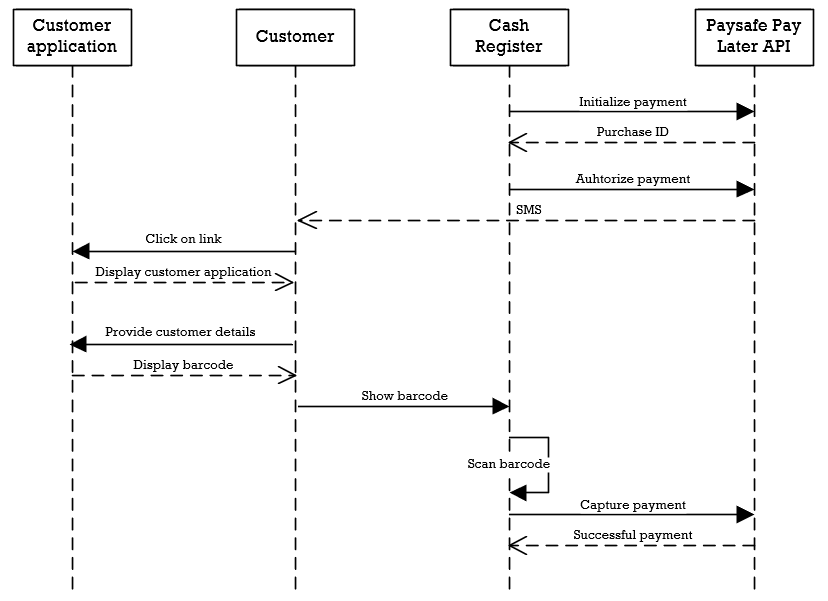
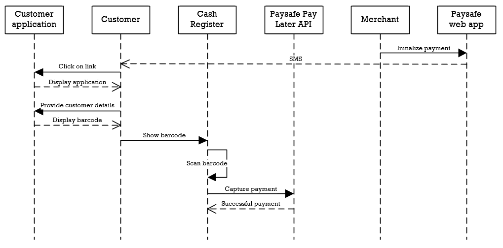

# Integrations: Cash register integration

Integration with a cash register takes little effort and provides secure confirmation of payments. The Cash register integration has two ways of starting the flow.

**Note**: all SDK examples assume the SDK has been initiliazed. For more details on how to initialize the SDK, check the paragraph 'SDK initialization' in the corosponding SDK documentation.

## Start at cash register



### 1. Initialize

This flow starts with the cash register specifying the amount of the order and invoking the initialize endpoint with the amount and currency. Optionaly, customer data can be provided to ease the application process for the customer. The success response of the initialize endpoint returns the **purchaseId** needed for the authorize endpoint.

**Rest endpoint**

```json http
{
  "method": "post",
  "url": "https://test-gateway.payolution.com/purchase/initialize",
  "headers": {
    "paysafe-pl-secret-key": "secret-key",
    "Content-Type": "application/json"
  },
  "body": {
    "purchaseAmount": {
      "amount": 50000,
      "currency": "EUR"
    }
  }
}
```

**Java SDK**

```java
InitializePurchaseRequest request = new InitializePurchaseRequest()
  .withPurchaseAmount(new Amount()
    .withAmount(50000L)
    .withCurrency(Currency.EUR));

ResponseWithAuthorization<PurchaseOperationResponse> purchaseResponse = 
  purchaseApi.intializePurchase(request, secretKey);

// Bearer eyJhbGciOiJSUzI1NiIsInR5cCI6IkpXVCJ9
String accessToken = purchaseResponse.getAuthorization();

PurchaseOperationResponse response = purchaseResponse.getResponse();
```

**PHP SDK**

```php
$request = new InitializePurchaseRequest(
  new Amount(50000, new Currency(Currency::EUR))
);

$purchaseResponse = $purchaseLifecycleApi->initializePurchase($request, $secretKey);

// Bearer eyJhbGciOiJSUzI1NiIsInR5cCI6IkpXVCJ9
$accessToken = $purchaseResponse->getAuthorization();

$response = $purchaseResponse->getResponse();
```

**Node.js SDK**

```javascript
const request = new InitializePurchaseRequest()
  .withPurchaseAmount(new Amount()
    .withAmount(50000)
    .withCurrency(Currency.EUR));

const purchaseResponse = await purchaseApi.intializePurchase(request, secretKey);

// Bearer eyJhbGciOiJSUzI1NiIsInR5cCI6IkpXVCJ9
const accessToken = purchaseResponse.authorization;

const response = purchaseResponse.response;
```

### 2. Authorize
Once a succesful initialize response has been received, the **purchaseId** can be provided together with the phone number of the customer to the authorize endpoint. This will send a SMS to the provided phone number.

**Rest endpoint**

```json http
{
  "method": "post",
  "url": "https://test-gateway.payolution.com/purchase/authorize/paylater",
  "headers": {
    "paysafe-pl-secret-key": "secret-key",
    "Content-Type": "application/json"
  },
  "body": {
    "purchaseId": "CID-kdifr9ho54zavijvr9jv",
    "phone": "+4300000000000",
    "method": "SMS"
  }
}
```

**Java SDK**

```java
AuthorizePurchaseRequest request = new AuthorizePurchaseRequest()
  .withPurchaseId("CID-kdifr9ho54zavijvr9jv")
  .withMethod(MethodType.SMS)
  .withPhone("+4300000000000");

PurchaseOperationResponse response = 
  purchaseAuthorizationApi.authorizePaylater(request, secretKey);
```

**PHP SDK**

```php
$request = new AuthorizePurchaseRequest(
  'CID-kdifr9ho54zavijvr9jv',
  new MethodType(MethodType::SMS),
  '+4300000000000',
  'https://example.com/successUrl',
  'https://example.com/callbackUrl'
);

$response = $purchaseAuthorizationApi->authorizePayLater($request, $secretKey);
```

**Node.js SDK**

```javascript
const request = new AuthorizePurchaseRequest()
  .withPurchaseId("CID-kdifr9ho54zavijvr9jv")
  .withMethod(MethodType.SMS)
  .withPhone("+4300000000000")
  .withSuccessUrl("https://example.com/successUrl")
  .withCallbackUrl("https://example.com/callbackUrl");

const purchaseOperationResponse = await purchaseAuthorizationApi.authorizePayLater(request, secretKey);
```

### 3. Paysafe Pay Later customer application

The customer will receive an SMS with a link. This link will take the customer through a series of screens for the customer to provide additional details. If any customer details are provided when invoking the initialize call, these details will be prefilled for the customer on these screens. At the end of the customer application, a barcode will be presented.

### 4. Capture

The barcode on the customers device can be scanned by the cash register and should invoke the capture endpoint with the orderId. The orderId is part of the barcode. The purchaseId received in the initialize response can also be used instead of the orderId.

**Rest endpoint**

```json http
{
  "method": "post",
  "url": "https://test-gateway.payolution.com/purchase/capture",
  "headers": {
    "paysafe-pl-secret-key": "secret-key",
    "Content-Type": "application/json"
  },
  "body": {
    "orderId": "75761090",
    "fulfillmentAmount": {
      "amount": 50000,
      "currency": "EUR"
    }
  }
}
```

**Java SDK**

```java
CapturePurchaseRequest captureRequest = new CapturePurchaseRequest()
  .withOrderId("75761090")
  .withFulfillmentAmount(new Amount()
    .withAmount(50000L)
    .withCurrency(Currency.EUR));

PurchaseOperationResponse response = purchaseApi.capturePurchase(request, secretKey);
```

**PHP SDK**

```php
$request = (new CapturePurchaseRequest(
	new Amount(50000, New Currency(Currency::EUR))
))->setOrderId('75761090');

$response = $purchaseAuthorizationApi->capturePurchase($request, $secretKey);
```

**Node.js SDK**

```javascript
const request = new CapturePurchaseRequest()
  .withOrderId("75761090")
  .withFulfillmentAmount(new Amount()
    .withAmount(50000)
    .withCurrency(Currency.EUR));

const purchaseOperationResponse = await purchaseApi.capturePurchase(request, secretKey);
```

## Start with webapp

This has the least amount of integration needed from the cash register as it will only need to handle capture requests.



### 1. Initialize & authorize

The flow starts with logging into the webapp of Paysafe and creating a new transaction (Contact your account manager for details on the webapp). An amount and customer phone number must be provided to create the transaction.

### 2. Paysafe Pay Later customer application

Once the transaction has been created in the webapp, the customer will receive an SMS with a link. This link will take the customer through a series of screens for the customer to provide additional details. If any customer details were provided when creating the transaction, these details will be prefilled for the customer on these screens. At the end of the customer application, a barcode will be presented.

### 3. Capture

The barcode on the customers device can be scanned by the cash register and should invoke the capture endpoint with the orderId. The orderId is part of the barcode.

**Rest endpoint**

```json http
{
  "method": "post",
  "url": "https://test-gateway.payolution.com/purchase/capture",
  "headers": {
    "paysafe-pl-secret-key": "secret-key",
    "Content-Type": "application/json"
  },
  "body": {
    "orderId": "75761090",
    "fulfillmentAmount": {
      "amount": 50000,
      "currency": "EUR"
    }
  }
}
```

**Java SDK**

```java
CapturePurchaseRequest captureRequest = new CapturePurchaseRequest()
  .withOrderId("75761090")
  .withFulfillmentAmount(new Amount()
    .withAmount(50000L)
    .withCurrency(Currency.EUR));

PurchaseOperationResponse response = purchaseApi.capturePurchase(request, secretKey);
```

**PHP SDK**

```php
$request = (new CapturePurchaseRequest(
	new Amount(50000, New Currency(Currency::EUR))
))->setOrderId('75761090');

$response = $purchaseAuthorizationApi->capturePurchase($request, $secretKey);
```

**Node.js SDK**

```javascript
const request = new CapturePurchaseRequest()
  .withOrderId("75761090")
  .withFulfillmentAmount(new Amount()
    .withAmount(50000)
    .withCurrency(Currency.EUR));

const purchaseOperationResponse = await purchaseApi.authorizePayLater(request, secretKey);
```